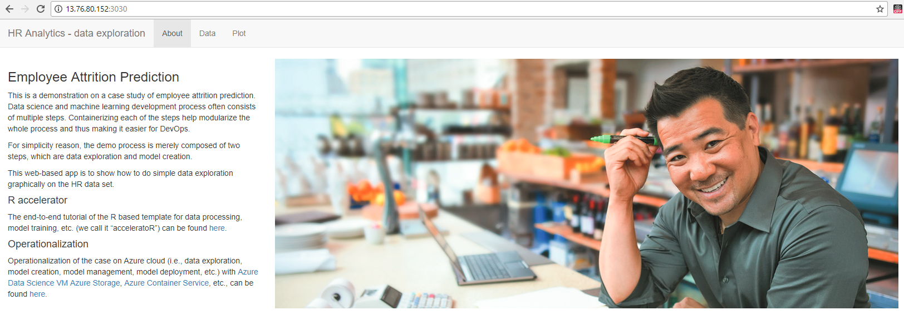
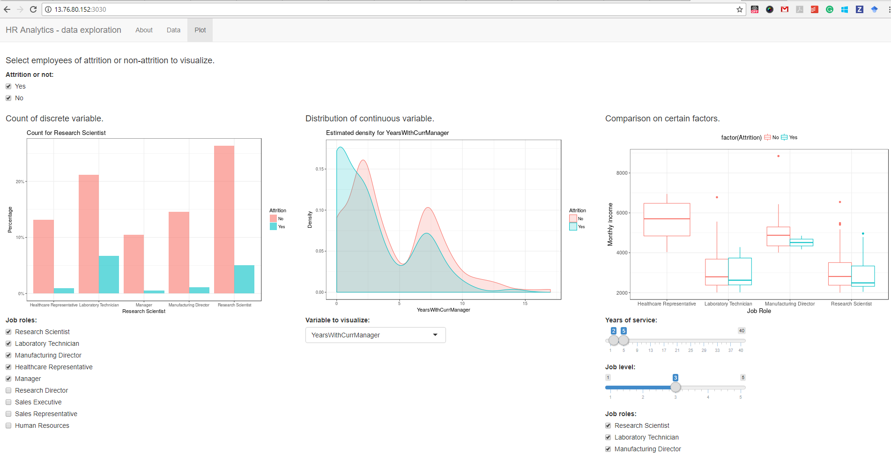
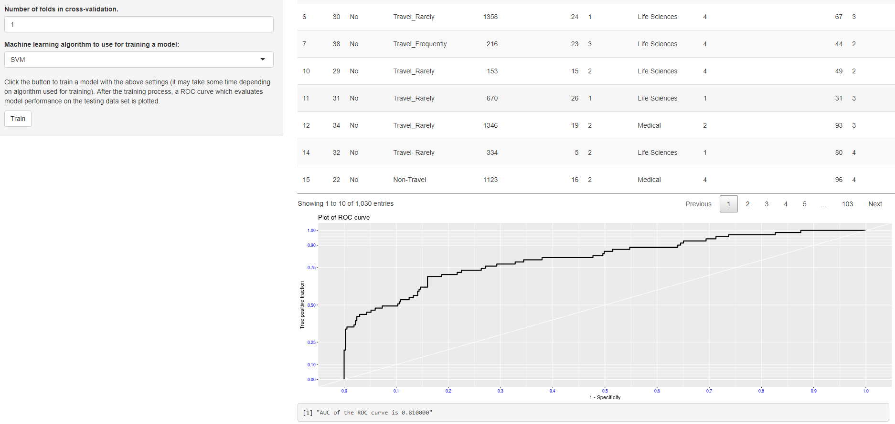

## Introduction

It is preferrable to create AI application hosted on cloud for obvious benefits 
of elasticity, agility, and flexibility of training model and deploying services.

The tutorial in this markdown will demonstrate how to operationalize the 
[Employee Attrition Prediction](https://github.com/Microsoft/acceleratoRs/tree/master/EmployeeAttritionPrediction)
on Azure cloud and then deploy the model as well as analytical functions onto 
web-based services.

## Data exploration and model training - Azure Data Science Virtual Machine

### Introduction

[Azure Data Science Virtual Machine (DSVM)](https://docs.microsoft.com/en-us/azure/machine-learning/machine-learning-data-science-provision-vm)
is a curated virtual machine image that is configured with a comprehensive set of
commonly used data analytical tools and software. DSVM is a desirable workplace
for data scientists to quickly experiment and prototype a data analytical idea. 

R packages [AzureSMR](https://github.com/Microsoft/AzureSMR) and [AzureDSVM](https://github.com/Azure/AzureDSVM)
are to simplify the use and operation of DSVM. One can use functions of the 
packages to easily create, stop, and destroy DSVMs in Azure resource group. To
get started, simply do initial set ups with an Azure subscription, as instructed
[here](http://htmlpreview.github.io/?https://github.com/Microsoft/AzureSMR/blob/master/inst/doc/Authentication.html).

### Set up a DSVM for employee attrition prediction

#### Pre-requisites

For this tutorial, a Ubuntu Linux DSVM is spinned up for the experiment. Since
the analysis is performed on a relatively small data set, a medium-size VM is 
sufficient. In this case, a Standard D2 v2 VM is used. It roughly costs 0.158 USD
per hour (more details about pricing can be found [here](https://azure.microsoft.com/en-us/pricing/details/virtual-machines/linux/).

The DSVM can be deployed by using either Azure portal, Azure Command-Line 
Interface, or AzureDSVM R package from within an R session. 

The following are the codes for deploying a Linux DSVM with Standard D2 v2 size.

```{r, eval=FALSE}
# Load the R packages for resource management.

library(AzureSMR)
library(AzureDSVM)
```

To start with `AzureSMR` and `AzureDSVM` packages for operating Azure resources,
it is required to create and set up an Azure Azure Directory App which is 
authorized for consuming Azure REST APIs. Details can be found in the AzureSMR package [vignette](https://github.com/Microsoft/AzureSMR/blob/master/vignettes/Authentication.Rmd)

After the proper set up, credentials such as client ID, tenant ID, and secret key
can be obtained.
Credentials for authentication are suggested to be put in a config.json file which is 
located at "~/.azuresmr" directory. `read.AzureSMR.config` function then reads
the config json file into an R object. The credentials are used to set an 
Azure Active Context which is then used for authentication.

```{r, eval=FALSE}
settingsfile <- getOption("AzureSMR.config")
config <- read.AzureSMR.config()

asc <- createAzureContext()

setAzureContext(asc, 
                tenantID=config$tenantID, 
                clientID=config$clientID, 
                authKey=config$authKey)
```

Authentication.

```{r, eval=FALSE}
azureAuthenticate(asc)
```

#### Deployment of DSVM

Specifications for deploying the DSVM are given as inputs of the deployment
function from `AzureDSVM`.

In this case, a resource group in Southeast Asia is created, and a Ubuntu DSVM
with Standard D2 v2 size is created. 

```{r, eval=FALSE}
dsvm_location <- "southeastasia"
dsvm_rg       <- paste0("rg", paste(sample(letters, 3), collapse=""))

dsvm_size     <- "Standard_D2_v2"
dsvm_os       <- "Ubuntu"
dsvm_name     <- paste0("dsvm", 
                        paste(sample(letters, 3), collapse=""))
dsvm_authen   <- "Password"
dsvm_password <- "Not$ecure123"
dsvm_username <- "dsvmuser"

```

After that, the resourece group can be created.

```{r, eval=FALSE}
# create resource group.

azureCreateResourceGroup(asc, 
                         location=dsvm_location, 
                         resourceGroup=dsvm_rg)

```

In the resource group, the DSVM with above specifications is created.

```{r, eval=FALSE}
# deploy a DSVM.

deployDSVM(asc, 
           resource.group=dsvm_rg,
           location=dsvm_location,
           hostname=dsvm_name,
           username=dsvm_username,
           size=dsvm_size,
           os=dsvm_os,
           authen=dsvm_authen,
           password=dsvm_password,
           mode="Sync")
```

#### Adding extension to DSVM

Some R packages (e.g., `caretEnsemble`) used in the accelerator are not
pre-installed in a freshly deployed Linux DSVM. These packages can be installed
post deployment with [Azure VM Extensions](https://docs.microsoft.com/en-us/azure/virtual-machines/windows/extensions-features) which is also available in `AzureDSVM`.

Basically the Azure Extensions function runs a script located remote on the
target VM. In this case, the script, named `script.sh`, is a Linux shell script
in which R packages that are needed but missing in the DSVM are installed.

The following R codes add extension to the deployed DSVM.

```{r, eval=FALSE}
# add extension to the deployed DSVM. 
# NOTE extension is installed as root.

dsvm_command <- "sudo sh script.sh"
dsvm_fileurl <- "https://raw.githubusercontent.com/Microsoft/acceleratoRs/master/EmployeeAttritionPrediction/Code/script.sh"

addExtensionDSVM(asc,
                 location=dsvm_location,
                 resource.group=dsvm_rg,
                 hostname=dsvm_name,
                 os=dsvm_os, 
                 fileurl=dsvm_fileurl, 
                 command=dsvm_command)
```

Once experiment with the accelerator is finished, deallocate the DSVM by
stopping it so that there will be no charge on the machine, 

```{r, eval=FALSE}
# Stop the DSVM if it is not needed.

operateDSVM(asc, 
            resource.group=dsvm_rg, 
            hostname=dsvm_name, 
            operation="Stop")
```

or destroy the whole resource group if the instances are not needed.

```{r, eval=FALSE}
# Resource group can be removed if the resources are no longer needed.

azureDeleteResourceGroup(asc, resourceGroup=dsvm_rg)
```

#### Remote access to DSVM

The DSVM can be accessed via several approaches:

* Remote desktop. [X2Go](https://wiki.x2go.org/doku.php) server is
pre-configured on a DSVM so one can used X2Go client to log onto that machine
and use it as a remote desktop.
* RStudio Server. RStudio Server is installed, configured, but not started
on a Linux DSVM. Starting RStudio Server is embedded in the DSVM extension, so 
after running the extension code above, one can access the VM via RStudio Server
 ("http://<dsvm_name>.<dsvm_location>.cloudapp.azure.com:8787"). The user name
 and password used in creating the DSVM can be used for log-in.
* Jupyter notebook. Similar to RStudio Server, R user can also work on the DSVM
within a Jupyter notebook environment. The remote JupyterHub can be accessed via
the address "https://<dsvm_name>.<dsvm_location>.cloudapp.azure.com:8000". To
enable an R environment, select R kernel when creating a new notebook.

The accelerator in both `.md` and `.ipynb` formats are provided for convenient
run in RStudio and Jupyter notebook environments, respectively.

## Service deployment 

The section shows how to consume data analytics in the accelerator on web-based
shiny applications. 

### Deployment of R application

It is usually desirable to deploy R analytics as applications. This allows non-R
-user data scientist to consume the pre-trained model or analytical results. For
instance, the model created in the employee attrition accelerator can be 
consumed by end users for either statistical analysis on raw data or real-time
attrition prediction.

#### Ways of deployment

There are various ways of deploying R analyics. 

* Deployment as API. Deployment of API will benefit downstream developers to 
consume the data analytics in other applications. It is flexible and efficient.
R packages such as `AzureML` and `mrsdeploy` allow deployment of R codes onto 
Azure Machine Learning Studio web service and web service hosted on a machine 
where Microsoft R Server is installed and configured, respectively. Other
packages such as `plumbr` also allows publishing R codes on a local host as
a web service.
* Deployment as GUI application. [R Shiny](https://shiny.rstudio.com/) is the most popular framework
for publishing R codes as GUI based application. The application can also be
publically accessible if it is hosted on Shiny server (not free). Shiny 
framework provides rich set of functions to define UI and server logic for 
static, responsive, and graphical interactions with application.
* Deployment as Container. [Docker](https://www.docker.com/) container becomes increasingly popular along
with the proliferation of microservice architecture. The benefits of running
container as a service is that different services can be easily modularized and
maintainence. For a data analytical or artificial intelligence solution, 
models of different purposes can be trained and deployed into different
containers whereever needed. 

The following sub-section will talk about how to create shiny applications
for the accelerlator and then containerize them.

#### Shiny + Docker container

R Shiny can be run on either a local host or a server where Shiny Server is
installed. 

There is also a [Shiny Server Docker image](https://hub.docker.com/r/rocker/shiny/) available, which makes it easy
for containerizing Shiny applications. The Dockerfile for the Shiny Server is 
built based on the `r-base` image and is shown as follows.

```
FROM r-base:latest

MAINTAINER Winston Chang "winston@rstudio.com"

# Install dependencies and Download and install shiny server
RUN apt-get update && apt-get install -y -t unstable \
    sudo \
    gdebi-core \
    pandoc \
    pandoc-citeproc \
    libcurl4-gnutls-dev \
    libcairo2-dev/unstable \
    libxt-dev && \
    wget --no-verbose https://s3.amazonaws.com/rstudio-shiny-server-os-build/ubuntu-12.04/x86_64/VERSION -O "version.txt" && \
    VERSION=$(cat version.txt)  && \
    wget --no-verbose "https://s3.amazonaws.com/rstudio-shiny-server-os-build/ubuntu-12.04/x86_64/shiny-server-$VERSION-amd64.deb" -O ss-latest.deb && \
    gdebi -n ss-latest.deb && \
    rm -f version.txt ss-latest.deb && \
    R -e "install.packages(c('shiny', 'rmarkdown'), repos='https://cran.rstudio.com/')" && \
    cp -R /usr/local/lib/R/site-library/shiny/examples/* /srv/shiny-server/ && \
    rm -rf /var/lib/apt/lists/*

EXPOSE 3838

COPY shiny-server.sh /usr/bin/shiny-server.sh

CMD ["/usr/bin/shiny-server.sh"]
```

A Docker image can be built by using the Dockerfile with

```
docker build -t <image_name> <path_to_the_dockerfile>
```
and run with

```
docker run --rm -p 3838:3838 <image_name>
```

The Shiny application can be then accessed in a web browser via address "http://localhost:3838" (if it is run on a local host machine) or "http://<ip_address_of_shiny_server:3838".

### Container orchestration

When there are more than one application or service needed in the whole 
pipeline, orchestration of multiple containers becomes useful.

There are multiple ways of orchestrating containers, and the three most
representative approaches are [Kubernetes](https://kubernetes.io/), [Docker Swarm](https://docs.docker.com/engine/swarm/), and [DC/OS](https://dcos.io/).

Comparison between these orchestration methods is beyond the scope of this 
tutorial. In the following sections, it will be shown how to deploy multiple
Shiny applications on a Kubernetes cluster.

#### Azure Container Service

[Azure Container Service](https://azure.microsoft.com/en-us/services/container-service/) is a cloud-based service on Azure, which simplifies the configuration 
for orchestrating containers with various orchestration methods such as 
Kubernetes, Docker Swarm, and DC/OS. Azure Container Service offers optimized
configuration of these orchestration tools and technologies for Azure. In 
deployment of the orchestration cluster, it is allowed to set VM size, number
of hosts, etc., for scalability, load capacity, cost efficiency, etc.

#### Deployment of multiple Shiny applications with Azure Container Service

The following illustrates how to deploy two Shiny applications derived from 
the employee attrition prediction accelerator with Azure Container Service.

While there may be more sophisticated architecture in real-world application,
the demonstration here merely exhibits a how-to on setting up the environment.

The two Shiny applications are for (simple) data exploration and model creation,
respectively. The two applications are built on top of two individual images.
Both obtain data from a Azure Storage blob, where data is persistently
preserved. This enables the real-world scenario where R-user data scientists and
data analysts are working within the same infrascture but tasks for each can be 
de-coupled loosely.

Samples of Dockerfile, configuration files for Shiny Server, and Shiny App R
scripts can be found at `hrDataExploration` and `hrModelCreation`, respectively.

The whole architecture is depicted as follows.

##### Step 1 - Create Docker images

Both of the images are created based on the rocker/shiny image.

* Data exploration image

```
FROM r-base:latest

MAINTAINER Le Zhang "zhle@microsoft.com"

RUN apt-get update && apt-get install -y -t unstable \
    sudo \
    gdebi-core \
    pandoc \
    pandoc-citeproc \
    libcurl4-gnutls-dev \
    libcairo2-dev/unstable \
    libxt-dev \
    libssl-dev 

# Download and install shiny server

RUN wget --no-verbose https://s3.amazonaws.com/rstudio-shiny-server-os-build/ubuntu-12.04/x86_64/VERSION -O "version.txt" && \
    VERSION=$(cat version.txt)  && \
    wget --no-verbose "https://s3.amazonaws.com/rstudio-shiny-server-os-build/ubuntu-12.04/x86_64/shiny-server-$VERSION-amd64.deb" -O ss-latest.deb && \
    gdebi -n ss-latest.deb && \
    rm -f version.txt ss-latest.deb

RUN R -e "install.packages(c('shiny', 'ggplot2', 'dplyr', 'magrittr', 'markdown'), repos='http://cran.rstudio.com/')" 

COPY shiny-server.conf /etc/shiny-server/shiny-server.conf
COPY /myapp /srv/shiny-server/

EXPOSE 3838

COPY shiny-server.sh /usr/bin/shiny-server.sh

RUN chmod +x /usr/bin/shiny-server.sh

CMD ["/usr/bin/shiny-server.sh"
```
* Model creation image

```
FROM r-base:latest

MAINTAINER Le Zhang "zhle@microsoft.com"

RUN apt-get update && apt-get install -y -t unstable \
    sudo \
    gdebi-core \
    pandoc \
    pandoc-citeproc \
    libcurl4-gnutls-dev \
    libcairo2-dev/unstable \
    libxt-dev \
    libssl-dev 

# Download and install shiny server

RUN wget --no-verbose https://s3.amazonaws.com/rstudio-shiny-server-os-build/ubuntu-12.04/x86_64/VERSION -O "version.txt" && \
    VERSION=$(cat version.txt)  && \
    wget --no-verbose "https://s3.amazonaws.com/rstudio-shiny-server-os-build/ubuntu-12.04/x86_64/shiny-server-$VERSION-amd64.deb" -O ss-latest.deb && \
    gdebi -n ss-latest.deb && \
    rm -f version.txt ss-latest.deb

RUN R -e "install.packages(c('shiny', 'ggplot2', 'dplyr', 'magrittr', 'caret', 'caretEnsemble', 'kernlab', 'randomForest', 'xgboost', 'DT'), repos='http://cran.rstudio.com/')" 

COPY shiny-server.conf /etc/shiny-server/shiny-server.conf
COPY /myapp /srv/shiny-server/

EXPOSE 3838

COPY shiny-server.sh /usr/bin/shiny-server.sh

RUN chmod +x /usr/bin/shiny-server.sh

# Download pre-trained model

RUN wget --no-verbose https://zhledata.blob.core.windows.net/employee/model.RData -O "/srv/shiny-server/model.RData"

CMD ["/usr/bin/shiny-server.sh"
```
All of the layers are the same as those in the original rocker/shiny image, except for installation of additional R packages and their required 
run time libraries (e.g., caretEnsemble, xgboost, etc.). It is worth noting that
the port number should also be specified in Shiny Server configuration file. 
Details can be found in the folder of these files. 

Docker images can be built similar to the rocker/shiny image. After the images
are built, they can be pushed onto a public repository such as on [Dockerhub](https://hub.docker.com/) or a private repository on [Azure Container Registry](https://azure.microsoft.com/en-us/services/container-registry/).

The following shows how to do that with Dockerhub.

1. Build the image.
```
docker build -t <name_of_image> <path_to_dockerfile>
```
2. Tag the image. 
```
docker tag <name_of_image> <dockerhub_account_name>/<name_of_repo>
```
3. Login with Dockerhub.
```
docker login
```
4. Push image onto Dockerhub repository.
```
docker push <dockerhub_account_name>/<name_of_repo>
```

In this case, both of the two images are pushed on Dockerhub.

To run the image as a container, use
```
docker run <dockerhub_account_name>/<name_of_repo> -p 3838:3838
```
Ideally the Shiny App should be accessible on the browser with `localhost:3838`
if it is run on a locally hosted docker container.

##### Step 2 - Create Azure Container Service

Creation of Azure Container Service can be achieved with either Azure portal or
Azure Command-Line Interface (CLI). 

The following shows how to create a Kubernetes type orchestrator in a specified
resource group with Azure CLI (installation of Azure CLI can be found [here](https://docs.microsoft.com/en-us/cli/azure/install-azure-cli?view=azure-cli-latest).

1. Login with Azure subscription.
```
az login
```
2. Create a resource group where the Azure Container Service cluster resides.
```
az group create --name=<resource_group> --location=<location>
```
3. Create an Azure Container Service with Kubernetes orchestrator. The 
cluster is made of one master node and three agent nodes. Name of 
cluster, DNS prefix, and authentication private key can also be specified as
requested.  
```
az acs create --orchestrator-type=kubernetes --resource-group <resource_group> --name=<cluster_name> --dns-prefix=<dns_prefix> --ssh-key-value ~/.ssh/id_rsa.pub --admin-username=<user_name> --master-count=1 --agent-count=2 --agent-vm-size=<vm_size>
```
##### Step 3 - Deploy Shiny applications on the Azure Container Service

The status of Azure Container Service deployment can be checked in Azure portal.
Once it is successfully done, there will be the resources listed in the resource
group.

In this tutorial, there are two Shiny applications hosted on the cluster. For 
simplicity reason, these two applications do not have dependency on each other,
so they are deployed independently and exposed as invidual service.

The deployment is done with [Kubernetes command line tool](https://kubernetes.io/docs/tasks/tools/install-kubectl/), which can be installed on the local machine.

kubectl should be configured properly in order to communicate with the remote
Kubernetes cluster. This can be done via copy the `config` file located at
`~/.kube` on master node of the Kubernetes cluster to `~/.kube/` of the local
machine.

Each of the two applications can be deployed individually as follows.
```
kubectl run <name_of_deployment> --image <dockerhub_account_name>/<name_of_repo>
--port=3838 --replicas=3
```
The deployment can be exposed as web-based service by the following command:
```
kubectl expose deployments <name_of_deployment> --port=3838 --type=LoadBalancer
```
Status of the deployment and service exposure can be monitored by 
```
kubectl get deployments
```
and 
```
kubectl get services
```
respectively.

The deployment and exposure of service can be put together into a yaml file for
convenience of operation.
```
apiVersion: apps/v1beta1
kind: Deployment
metadata:
  name: <name_of_model_app>
spec:
  replicas: 1
  template:
    metadata:
      labels:
        app: <name_of_model_app>
    spec:
      containers:
      - name: <name_of_model_app>
        image: <dockerhub_account_name>/<name_of_model_app> 
        ports:
        - containerPort: 3838
        resources:
          requests:
            cpu: 250m
          limits:
            cpu: 500m
---
apiVersion: v1
kind: Service
metadata:
  name: <name_of_model_app>
spec:
  type: LoadBalancer
  ports:
  - port: 3838
  selector:
    app: <name_of_model_app>
---
apiVersion: apps/v1beta1
kind: Deployment
metadata:
  name: <name_of_data_app>
spec:
  replicas: 1
  template:
    metadata:
      labels:
        app: <name_of_data_app>
    spec:
      containers:
      - name: <name_of_data_app>
        image: <dockerhub_account_name>/<name_of_data_app> 
        ports:
        - containerPort: 3030
        resources:
          requests:
            cpu: 250m
          limits:
            cpu: 500m
---
apiVersion: v1
kind: Service
metadata:
  name: <name_of_data_app>
spec:
  type: LoadBalancer
  ports:
  - port: 3030
  selector:
    app: <name_of_data_app>
```
The deployment and service can then be created simply by 
```
kubectl create -f <path_to_the_yaml_file>
```

##### Step 4 - Test the deployed Shiny applications

Once the deployment is finished, public IP address and port number of the 
exposed service can be checked with `kubectl get service --watch`. In the 
deployment process, external IP addresses of the exposed services will show
"<pending>". It usually takes a while to finish depending on the size of the 
image and capability of cluster.

The deployed Shiny application service can be accessed from web browser via the
public IP address with corresponding port number.

The following snapshots show the deployed Shiny apps. 

* Front page - brief introduction of the Shiny apps. The pic below shows the 
Shiny app opened in a web browser with the IP address and port number specified
in the Dockerfile and Shiny Server configuration file.

* Data exploration - the application is for simple interactive data explorative
analytics, e.g., visualization of discrete and continuous variables against two
types of attrition status of employee data. Parameters of these plots can be 
set interactively on the web.

* Model training - it can be done with the selected hyper parameters. Clicking
the button will train the model on line and generate a ROC curve based on the
validation results against testing data set.


The readers can find Dockerfile as well as Shiny R codes in the directories. 
Images built based on them are pre-published on Dockerhub - `yueguoguo/hrdata`
and `yueguoguo/hrmodel`, corresponding to the data exploration application and
model creation application, respectively. These images are ready for testing
on a deployed Kubernetes typed Azure Container Service cluster.