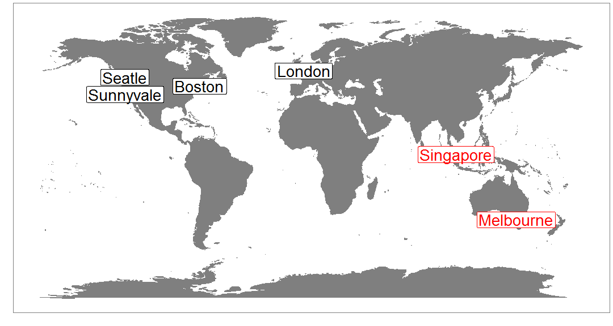
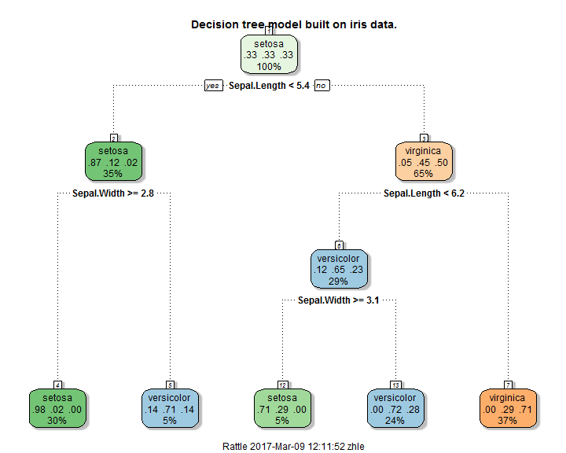
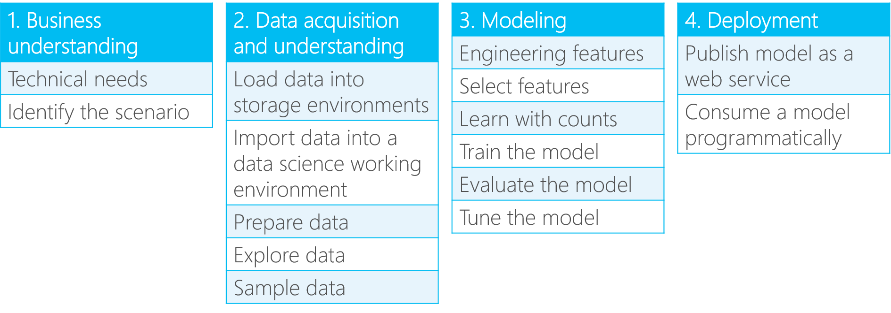
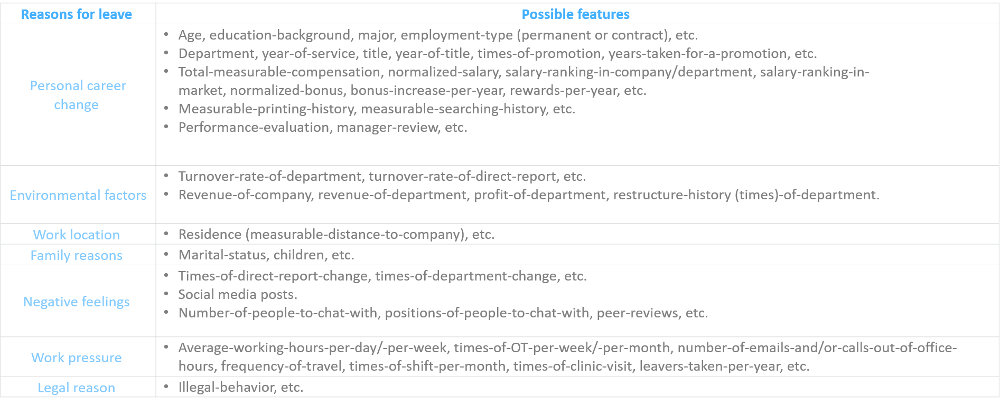
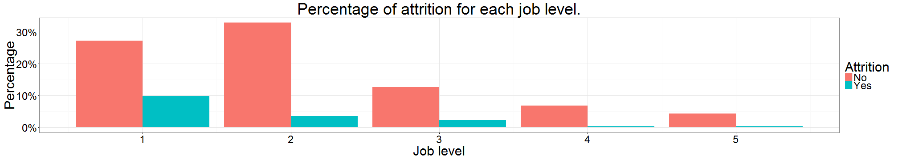

Employee Attrition Prediction with R Accelerator
========================================================
author: Le Zhang, Data Scientist at Microsoft
date: 2017-03-09
width: 1800
height: 1000

Agenda
========================================================


- Introduction.
- How to predict employee attrition?
- Walk-through of an R "accelerator".

Introduction
========================================================

- Microsoft Algorithms and Data Science (ADS).



- ADS Asia Pacific. 
    - Data science solution templates to resolve real-world problems.
    - Scalable tools & algorithms for high performance advanced analytics.

Data science and machine learning
========================================================

- Data science & Machine learning
- A review on iris data.



General work flow of data science project
========================================================

- Cross Industry Standard Process for Data Mining (CRISP-DM)
- Team Data Science Process (TDSP) https://github.com/Azure/Microsoft-TDSP

    

Use case - employee attrition prediction
========================================================

    

- Consequences of employee attrition.
    - Loss of human resources and cost on new hires.
    - Potential loss of company intellectual properties.
- Problem formalization: **to identify employees with inclination of leaving.**

Data collection, exploration, and preparation
========================================================



- Static data: not change or change in a deterministic manner.
- Dynamic data: change randomly over time.

Data collection, exploration, and preparation
========================================================

- Data source 
    - HR department.
    - IT department.
    - Direct reports.
    - Social media network.

Data collection, exploration, and preparation
========================================================

- Data exploration.
    - Statistics.
    - Visualization!
    
Data collection, exploration, and preparation
========================================================



Feature Extraction
========================================================

<center></center>
    
Feature Extraction (Cont'd)
========================================================

-Feature engineering
    - Statistics
        - max, min, standard deviation, etc.
    - Time series characterization.
        - Trend analysis.
        - Anomaly detection.
        - Time series model (ARIMA, etc.)
    - Text mining
- Feature selection.
    - Correlation analysis.
    - Model based feature selection.

Model creation and validation
========================================================

- Algorithm selection
    - Logistic regression, Support vector machine, Decision tree, etc.
    - Ensemble
        - Bagging.
        - Boosting.
        - Stacking.
- Model creation
    
Model creation and validation
========================================================

- Cross validation.
- Confusion matrix.
    - Precision.
    - Recall.
    - F Score.
    - Area-Under-Curve.

Employee attrition prediction - R accelerator
========================================================

- What is R "accelerator"
    - Lightweight end-to-end solution template.
    - Follows Microsoft Team Data Science Process (TDSP) format, in a simplified version.
    - Easy for prototyping, presenting, and documenting.
    - Github repo https://github.com/Microsoft/acceleratoRs

Step 0 Setup
========================================================

R session for the employee attrition prediction accelerator.


```
R version 3.3.2 (2016-10-31)
Platform: x86_64-w64-mingw32/x64 (64-bit)
Running under: Windows 10 x64 (build 14393)

attached base packages:
[1] grid      stats     graphics  grDevices utils     datasets  methods  
[8] base     

other attached packages:
 [1] maps_3.1.0           ggmap_2.6.1          scales_0.4.0        
 [4] jsonlite_1.0         XML_3.98-1.4         httr_1.2.1          
 [7] tm_0.6-2             NLP_0.1-9            rattle_4.1.0        
[10] e1071_1.6-7          pROC_1.8             caretEnsemble_2.0.0 
[13] caret_6.0-70         ggplot2_2.1.0        DMwR_0.4.1          
[16] readr_0.2.2          stringi_1.1.2        stringr_1.1.0       
[19] magrittr_1.5         dplyr_0.5.0          knitr_1.15          
[22] RevoUtilsMath_10.0.0 RevoUtils_10.0.2     RevoMods_10.0.0     
[25] MicrosoftML_1.0.0    mrsdeploy_1.0        RevoScaleR_9.0.1    
[28] lattice_0.20-34      rpart_4.1-10        

loaded via a namespace (and not attached):
 [1] splines_3.3.2          foreach_1.4.3          gtools_3.5.0          
 [4] assertthat_0.1         TTR_0.23-1             highr_0.6             
 [7] sp_1.2-3               stats4_3.3.2           slam_0.1-35           
[10] quantreg_5.26          chron_2.3-47           digest_0.6.10         
[13] RColorBrewer_1.1-2     minqa_1.2.4            colorspace_1.2-6      
[16] Matrix_1.2-7.1         plyr_1.8.4             SparseM_1.7           
[19] gdata_2.17.0           jpeg_0.1-8             lme4_1.1-12           
[22] MatrixModels_0.4-1     tibble_1.2             mgcv_1.8-15           
[25] car_2.1-2              ROCR_1.0-7             pbapply_1.2-1         
[28] nnet_7.3-12            proto_0.3-10           pbkrtest_0.4-6        
[31] quantmod_0.4-5         RJSONIO_1.3-0          evaluate_0.10         
[34] nlme_3.1-128           MASS_7.3-45            gplots_3.0.1          
[37] xts_0.9-7              class_7.3-14           tools_3.3.2           
[40] CompatibilityAPI_1.1.0 data.table_1.9.6       geosphere_1.5-5       
[43] RgoogleMaps_1.2.0.7    rpart.plot_2.1.0       kernlab_0.9-24        
[46] munsell_0.4.3          caTools_1.17.1         nloptr_1.0.4          
[49] iterators_1.0.8        RGtk2_2.20.31          rjson_0.2.15          
[52] labeling_0.3           bitops_1.0-6           gtable_0.2.0          
[55] codetools_0.2-15       abind_1.4-3            DBI_0.5               
[58] curl_1.2               reshape2_1.4.1         R6_2.1.3              
[61] gridExtra_2.2.1        zoo_1.7-13             KernSmooth_2.23-15    
[64] parallel_3.3.2         Rcpp_0.12.6            mapproj_1.2-4         
[67] png_0.1-7             
```

Step 1 Data exploration
========================================================

- Employee attrition data: https://www.ibm.com/communities/analytics/watson-analytics-blog/hr-employee-attrition/


```r
dim(df1)
```

```
[1] 1470   33
```

- Review comments data: http://www.glassdoor.com


```r
head(df2$Feedback, 3)
```

```
[1] "People are willing to share knowledge which is not the norm in this industry This is the first place I have worked where the people are great about that Also I get to work on cool projects that no one else in the world works on"
[2] "To repeat what I wrote before the people I work for and work with here are very smart and confident people"                                                                                                                         
[3] "The variety of different projects and the speed of completion I am truly very satisfied  pleased there is an endless list of pros"                                                                                                  
```

Step 2 Data preprocessing
========================================================

- Handle NAs.
- Remove non-variants.
- Normalization.
- Data type conversion.


```r
# get predictors that has no variation.

pred_no_var <- names(df1[, nearZeroVar(df1)]) %T>% print()
```

```
[1] "EmployeeCount" "StandardHours"
```


```r
# remove the zero variation predictor columns.

df1 %<>% select(-one_of(pred_no_var))
```

Step 2 Data preprocessing (Cont'd)
========================================================


```r
# convert certain interger variable to factor variable.

int_2_ftr_vars <- c("Education", "EnvironmentSatisfaction", "JobInvolvement", "JobLevel", "JobSatisfaction", "NumCompaniesWorked", "PerformanceRating", "RelationshipSatisfaction", "StockOptionLevel")

df1[, int_2_ftr_vars] <- lapply((df1[, int_2_ftr_vars]), as.factor)
```


```r
df1 %<>% mutate_if(is.character, as.factor)
```

Step 2 Feature extraction
========================================================

- Feature selection with a trained model.


```r
control <- trainControl(method="repeatedcv", number=3, repeats=1)

# train the model

model <- train(dplyr::select(df1, -Attrition), 
               df1$Attrition,
               data=df1, 
               method="rf", 
               preProcess="scale", 
               trControl=control)
```

Step 2 Feature extraction (Cont'd)
========================================================


```r
# estimate variable importance

imp <- varImp(model, scale=FALSE)

plot(imp, cex=3)
```


Step 2 Feature extraction (Cont'd)
========================================================


```r
# select the top-ranking variables.

imp_list <- rownames(imp$importance)[order(imp$importance$Overall, decreasing=TRUE)]

# drop the low ranking variables. Here the last 3 variables are dropped. 

top_var <- 
  imp_list[1:(ncol(df1) - 3)] %>%
  as.character() %T>%
  print()
```

```
 [1] "MonthlyIncome"            "OverTime"                
 [3] "NumCompaniesWorked"       "Age"                     
 [5] "DailyRate"                "TotalWorkingYears"       
 [7] "JobRole"                  "DistanceFromHome"        
 [9] "MonthlyRate"              "HourlyRate"              
[11] "YearsAtCompany"           "PercentSalaryHike"       
[13] "EnvironmentSatisfaction"  "StockOptionLevel"        
[15] "EducationField"           "TrainingTimesLastYear"   
[17] "YearsWithCurrManager"     "JobSatisfaction"         
[19] "WorkLifeBalance"          "YearsSinceLastPromotion" 
[21] "JobLevel"                 "JobInvolvement"          
[23] "RelationshipSatisfaction" "Education"               
[25] "YearsInCurrentRole"       "MaritalStatus"           
[27] "BusinessTravel"           "Department"              
```

Step 3 Resampling
========================================================

- Split data set into trainning and testing sets.


```r
train_index <- 
  createDataPartition(df1$Attrition,
                      times=1,
                      p=.7) %>%
  unlist()

df1_train <- df1[train_index, ]
df1_test <- df1[-train_index, ]
```


```r
table(df1_train$Attrition)
```

```

 No Yes 
864 166 
```

- Training set is not balanced!

Step 3 Resampling (Cont'd)
========================================================

To handle imbalanced data sets

- Cost-sensitive learning.
- Resampling of data.
    - Synthetic Minority Over-sampling TechniquE (SMOTE)
        - Upsampling minority class synthetically.
        - Downsampling majority class.

***


```r
df1_train %<>% as.data.frame()

df1_train <- SMOTE(Attrition ~ .,
                  df1_train,
                  perc.over=300,
                  perc.under=150)
```


```r
table(df1_train$Attrition)
```

```

 No Yes 
747 664 
```

Step 4 Model building
========================================================

- Select algorithm for model creation.
- Tune model parameters.
- Cross validation for searching the optimal model.


```r
# initialize training control. 

tc <- trainControl(method="repeatedcv", 
                   number=3, 
                   repeats=3, 
                   search="grid",
                   classProbs=TRUE,
                   savePredictions="final",
                   summaryFunction=twoClassSummary)
```

Step 4 Model building (Cont'd)
========================================================

Let's try several machine learning algorithms.

- Support vector machine.


```r
# SVM model.

time_svm <- system.time(
  model_svm <- train(Attrition ~ .,
                     df1_train,
                     method="svmRadial",
                     trainControl=tc)
)
```

Step 4 Model building (Cont'd)
========================================================

- Random forest.


```r
# random forest model

time_rf <- system.time(
  model_rf <- train(Attrition ~ .,
                     df1_train,
                     method="rf",
                     trainControl=tc)
)
```

Step 4 Model building (Cont'd)
========================================================

- Extreme gradient boosting (XGBoost).


```r
# xgboost model.

time_xgb <- system.time(
  model_xgb <- train(Attrition ~ .,
                     df1_train,
                     method="xgbLinear",
                     trainControl=tc)
)
```

Step 4 Model building (Cont'd)
========================================================

An ensemble may be better?

- Ensemble of models.
- Ensemble methods - bagging, boosting, and stacking.


***


```r
# ensemble of the three models.

time_ensemble <- system.time(
  model_list <- caretList(Attrition ~ ., 
                          data=df1_train,
                          trControl=tc,
                          methodList=c("svmRadial", "rf", "xgbLinear"))
)
```


```r
# stack of models. Use glm for meta model.

model_stack <- caretStack(
  model_list,
  metric="ROC",
  method="glm",
  trControl=trainControl(
    method="boot",
    number=10,
    savePredictions="final",
    classProbs=TRUE,
    summaryFunction=twoClassSummary
  )
)
```

Step 5 Model evaluating
========================================================

- Confusion matrix.
- Performance measure.


```r
predictions <-lapply(models, 
                     predict, 
                     newdata=select(df1_test, -Attrition))
```


```r
# confusion matrix evaluation results.

cm_metrics <- lapply(predictions,
                     confusionMatrix, 
                     reference=df1_test$Attrition, 
                     positive="Yes")
```

Step 5 Model evaluating (Cont'd)
========================================================

- Comparison of different models in terms of accuracy, recall, precision, and elapsed time.


```
         Models Accuracy Recall Precision Elapsed
1       SVM RBF     0.88   0.86      0.58   27.69
2 Random Forest     0.93   0.86      0.73  220.19
3       Xgboost     0.92   0.89      0.68  290.05
4      Stacking     0.92   0.90      0.71   84.36
```

- Analysis
    - Ensemble method excels from all.
    - Diversity of model affects ensemble performance.

Step 6 Sentiment analysis - a glimpse of data
========================================================

```r
# getting the data.

head(df2$Feedback, 5)
```

```
[1] "People are willing to share knowledge which is not the norm in this industry This is the first place I have worked where the people are great about that Also I get to work on cool projects that no one else in the world works on"
[2] "To repeat what I wrote before the people I work for and work with here are very smart and confident people"                                                                                                                         
[3] "The variety of different projects and the speed of completion I am truly very satisfied  pleased there is an endless list of pros"                                                                                                  
[4] "As youve probably heard Google has great benefits insurance and flexible hours If you want to you can work from home"                                                                                                               
[5] "Great insurance benefits free food equipment is available whenever you want it to be and there is always whatever you need monitor etc"                                                                                             
```

Step 7 Sentiment analysis - feature extraction
========================================================

- General methods
    - Initial transformation 
        - Removal of unnecessary elements (stopwords, numbers, punctuations, etc.).
            - Stopwords: yes, no, you, I, etc.
        - Translation or sentence/word alignment.
            - Multi-lingual text analysis.
        - POS tagging.
    - Bag-of-words model
        - n-Grams.
        - Term frequency (TF) or Term frequency inverse-document frequency (TF-IDF).
    - Model creation

Step 7 Sentiment analysis - feature extraction (Cont'd)
========================================================


```r
# create a corpus based upon the text data.

corp_text <- Corpus(VectorSource(df2$Feedback))
```


```r
# transformation on the corpus.

corp_text %<>%
  tm_map(removeNumbers) %>%
  tm_map(content_transformer(tolower)) %>%
  tm_map(removeWords, stopwords("english")) %>%
  tm_map(removePunctuation) %>%
  tm_map(stripWhitespace) 
```


```r
dtm_txt_tf <- 
  DocumentTermMatrix(corp_text, control=list(wordLengths=c(1, Inf), weighting=weightTf)) 
```


```r
# remove sparse terms.

dtm_txt <-
  removeSparseTerms(dtm_txt_tf, 0.99)
```

Step 7 Sentiment analysis - feature extraction (Cont'd)
========================================================

- Convert corpus to term frequency matrix.


```r
dtm_txt_sample <- removeSparseTerms(dtm_txt_tf, 0.85)
inspect(dtm_txt_sample[1:10, ]) 
```

```
<<DocumentTermMatrix (documents: 10, terms: 6)>>
Non-/sparse entries: 19/41
Sparsity           : 68%
Maximal term length: 7
Weighting          : term frequency (tf)

    Terms
Docs company google great people smart work
  1        0      0     1      2     0    1
  2        0      0     0      2     1    2
  3        0      0     0      0     0    0
  4        0      1     1      0     0    1
  5        0      0     1      0     0    0
  6        0      0     0      2     1    1
  7        0      0     0      0     0    0
  8        0      0     1      1     0    3
  9        0      0     1      0     0    0
  10       0      0     0      1     0    1
```


Step 8 Sentiment analysis - model creation and validation
========================================================

- Create and validate a classification model.


```r
# form the data set

df_txt %<>% cbind(Attrition=df2$Attrition)
```

```r
# split data set into training and testing set.

train_index <- 
  createDataPartition(df_txt$Attrition,
                      times=1,
                      p=.7) %>%
  unlist()

df_txt_train <- df_txt[train_index, ]
df_txt_test <- df_txt[-train_index, ]
```

Step 8 Sentiment analysis - model creation and validation (Cont'd)
========================================================

- SVM is used.


```r
# model building

model_sent <- train(Attrition ~ .,
                    df_txt_train,
                    method="svmRadial",
                    trainControl=tc)
```


```r
prediction <- predict(model_sent, newdata=select(df_txt_test, -Attrition))
```

Step 8 Sentiment analysis - model creation and validation (Cont'd)
========================================================


```
Confusion Matrix and Statistics

          Reference
Prediction No Yes
       No  85  13
       Yes  5  47
                                         
               Accuracy : 0.88           
                 95% CI : (0.817, 0.9273)
    No Information Rate : 0.6            
    P-Value [Acc > NIR] : 3.564e-14      
                                         
                  Kappa : 0.7443         
 Mcnemar's Test P-Value : 0.09896        
                                         
            Sensitivity : 0.7833         
            Specificity : 0.9444         
         Pos Pred Value : 0.9038         
         Neg Pred Value : 0.8673         
             Prevalence : 0.4000         
         Detection Rate : 0.3133         
   Detection Prevalence : 0.3467         
      Balanced Accuracy : 0.8639         
                                         
       'Positive' Class : Yes            
                                         
```

Takeaways
========================================================
- DS & ML combined with domain knowledge.
- Feature engineering takes majority of time.
- Scale up your analytics?
- All resources available on Github!

References
========================================================

1. Terence R. Michelle et al., "Why people stay: using job embeddedness to predict voluntary turnover".
2. Bo Pang and Lillian Lee, "Opinion mining and sentiment analysis".
3. Nitesh V. Chawla et al., "SMOTE: Synthetic Minority Over-sampling Technique".

Contact
========================================================

Le Zhang 

zhle@microsoft.com
