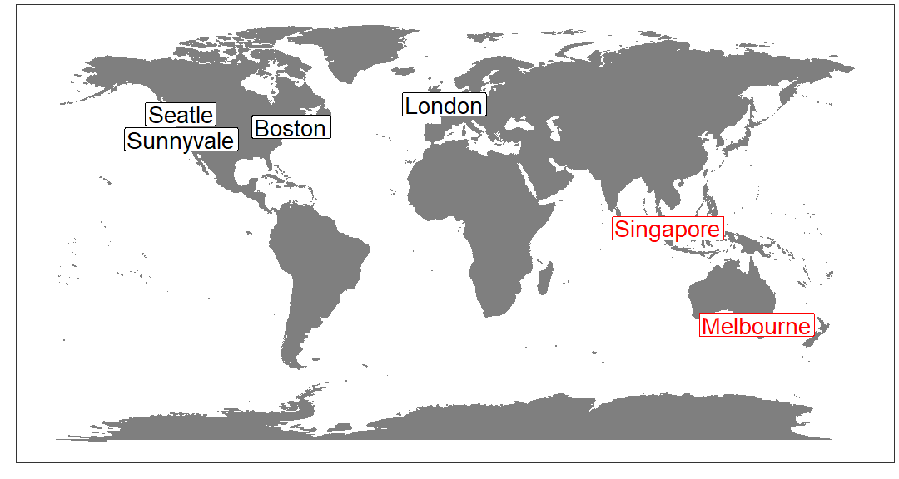

Employee Attrition Prediction with R Accelerator
========================================================
author: Le Zhang, Data Scientist at Microsoft
date: 2018-06-25
width: 1800
height: 1000

Agenda
========================================================


- Introduction.
- How to predict employee attrition?
- Walk-through of an R "accelerator".

Introduction
========================================================

- Microsoft Algorithms and Data Science (ADS).



- ADS Asia Pacific. 
    - Data science solution templates to resolve real-world problems.
    - Scalable tools & algorithms for high performance advanced analytics.

Data science and machine learning
========================================================

- Data science & Machine learning
- A review on iris data.


```
Error in loadNamespace(name) : there is no package called 'rpart.plot'
```
