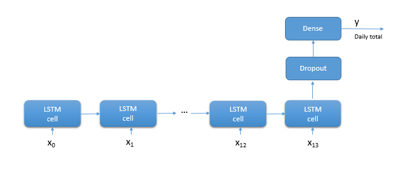
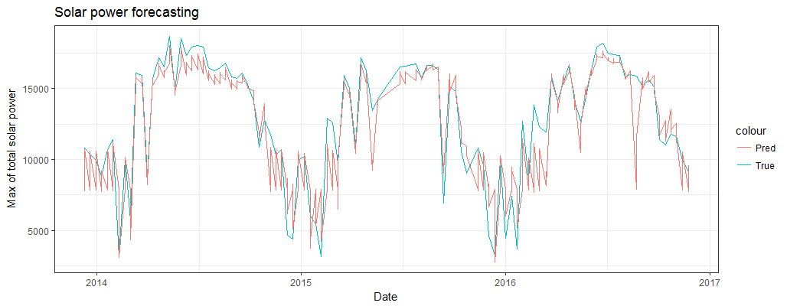

This accelerator is a reproduction of CNTK tutorial 106 B - using LSTM
for time series forecasting in R. The original tutorial can be found [here](https://github.com/Microsoft/CNTK/blob/master/Tutorials/CNTK_106B_LSTM_Timeseries_with_IOT_Data.ipynb).

The accelerator here mainly demonstrates how one can use `keras` R interface 
together with CNTK backend, to train a LSTM model for solar power forecasting,
in a Azure Data Science Virtual Machine (DSVM).

## 1 Introduction

### 1.1 Context.

[Solar power forecasting](https://en.wikipedia.org/wiki/Solar_power_forecasting)
is a challenging and important problem. Analyzing historical time-series data of
solar power generation may help predict the total amount of energy produced by 
solar panels. 

More discussion about solar power forecasting can be found in Wikipedia page. The
problem in this accelerator, is a simplified model, which is to merely illustrate
how an R based LSTM model can be trained in an Azure DSVM.

### 1.2 Overall introduction

Overall introduction of model techniques, training framework, and cloud 
computing resources can be found in another markdown file.

## 2 Step by step tutorial

### 2.1 Set up

Load the following R packages for this tutorial.

```{r}
library(keras)
library(magrittr)
library(dplyr)
library(readr)
library(ggplot2)
```

### 2.2 Data pre-processing

#### 2.2.1 Data downloading.

The original data set is preserved at [here](https://guschmueds.blob.core.windows.net/datasets/solar.csv).

For convenience of reproducition, the data is downloaded onto local system.

```{r}
data_url <- "https://guschmueds.blob.core.windows.net/datasets/solar.csv"

data_dir  <- tempdir()
data_file <- tempfile(tmpdir=data_dir, fileext="csv")

# download data.

download.file(url=data_url,
              destfile=data_file)
```

```{r}
# Read the data into memory.

df_panel <- read_csv(data_file)
```

#### 2.2.2 Data understanding

The original data set is in the form of 

|Time | solar.current | solar.total|
|------------------|----------|-----------|
|2013-12-01 7:00|6.30|1.69|
|2013-12-01 7:30|44.30|11.36|
|2013-12-01 8:00|208.00|67.50|
|...|...|...|
|2016-12-01 12:00|1815.00|5330.00|

The first column is the time stamp of when solar panel is read. The frequency of
reading is once per half an hour. The second and the third columns are current
power at the time of reading and the total reading so far on the day.

The data can be interactively explored visually by the following codes.

```{r}
# Take a glimpse of the data.

glimpse(df_panel)

ggplot(df_panel, aes(x=solar.current)) +
  geom_histogram()
```

#### 2.2.3 Data re-formatting.

The objective is, by using a sequence of current solar power readings, the max
value of total power reading on that day can be predicted. 

Since every day the solar panel power data points may be different - a unique
length, 14, is then used for each day. That is, in a daily basis, a univariate
times series of 14 elements (14 readings of solar panel power) are
formed as input data, in order to predict the maximum value of total power
generation of that day.

Following this principle, the data of a day is then re-formatted as

|Time series | Predicted target|
|-------------------|-----------|
|1.7, 11.4|10300|
|1.7, 11.4, 67.5|10300|
|1.7, 11.4, 67.5, 250.5|10300|
|1.7, 11.4, 67.5, 250.5, 573.5|10300|
|...|...|

For training purpose, time stamp is not necessary so the re-formed data are
aggregated as a set of sequences. 

The following codes accomplish the processing task, in which there are also
sub-tasks for normalization, maximization and minimization, grouping, etc.

1. Normalize the data as LSTM does not perform well on the un-scaled data.
```{r}
# Functions for 0-1 normalization.

normalizeData <- function(data) {
  (data - min(data)) / (max(data) - min(data))
}

denomalizeData <- function(data, max, min) {
  data * (max - min) + min
}

df_panel_norm <-
  mutate(df_panel, solar.current=normalizeData(solar.current)) %>%
  mutate(solar.total=normalizeData(solar.total)) %T>%
  print()

# Save max and min values for later reference, to reconcile original data
# when necessary.

normal_ref <- list(current_max=max(df_panel$solar.current),
                   current_min=min(df_panel$solar.current),
                   total_max=max(df_panel$solar.total),
                   total_min=min(df_panel$solar.total))
```

2. Grouping the data by day.
```{r}
df_panel_group <-
  mutate(df_panel_norm, date = as.Date(time)) %>%
  group_by(date) %>%
  arrange(date) %T>%
  print()
```

3. Append the columns "solar.current.max" and "solar.total.max"
```{r}
# Compute the max values for current and totatl power generation for each day.

df_panel_current_max <-
  summarise(df_panel_group, solar.current.max = max(solar.current)) %T>%
  print()

df_panel_total_max <-
  summarise(df_panel_group, solar.total.max = max(solar.total)) %T>%
  print()

# Append the max values of power generation.

df_panel_max <- 
  df_panel_current_max %>%
  mutate(solar.total.max=df_panel_total_max$solar.total.max) %>%
  mutate(day_id=row_number())

df_panel_group$solar.current.max <- df_panel_max$solar.current.max[match(df_panel_group$date, df_panel_max$date)]
df_panel_group$solar.total.max   <- df_panel_max$solar.total.max[match(df_panel_group$date, df_panel_max$date)]

df_panel_all <-
  df_panel_group %T>%
  print()
```

4. Generate the time series sequences for each day.

NOTE: **according to the original [CNTK tutorial](https://github.com/Microsoft/CNTK/blob/master/Tutorials/CNTK_106B_LSTM_Timeseries_with_IOT_Data.ipynb), those days with less than 8 readings are
omitted from the data, and those with more than 14 readings are truncated. 
```{r}
# Find the days that have more than 8 readings.

day_more_than_8 <- 
  summarise(df_panel_all, group_size = n()) %>%
  filter(group_size > 8) %>%
  select(date) 

# Get those days with more than 8 readings, and truncate the number of readings
# to be equal or less than 14.

df_panel_seq <- 
  df_panel_all[which(as.Date(df_panel_all$date) %in% as.Date(day_more_than_8$date)), ] %>%
  filter(row_number() <= 14) %>%
  mutate(ndata = n()) %T>%
  print()
```

According to the data format, for each day, the first sequence is composed by 
the initial two readings, and the next is generated by appending it with the 
power reading at next time step. The process iterates until all the readings
on that day form the last sequence.

Function to generate the sequence is as follows.

```{r}
genSequence <- function(data) {
  if (!"day_id" %in% names(data))
    stop("Input data frame does not have Day ID (day_id) column!")
  
  # since 14 is the maximum value so each day there are 13 readings as presumbly
  # it starts with 2 initial readings.
  # NOTE: the difference from approach in this tutorial to that in CNTK official tutorial is here
  # the meter readings are padded with 0s. This is because keras interface does not take list as input.
   
  date <- as.character(0)
  x    <- array(0, dim=c(14 * n_groups(data), 14, 1))
  y    <- array(0, dim=c(14 * n_groups(data), 1))
  
  index <- 1
  
  cat("Generating data ...")
  
  for (j in unique(data$day_id)) {
    readings <- select(filter(data, day_id == j), 
                       solar.total,
                       solar.total.max,
                       date)
    
    readings_date <- readings$date
    readings_x    <- as.vector(readings$solar.total)
    readings_y    <- as.vector(readings$solar.total.max)
    
    reading_date <- unique(readings_date)
    reading_y    <- unique(readings_y)
    
    for (i in 2:nrow(readings)) {
      x[index, 1:i, 1]   <- readings_x[1:i]
      y[index, 1] <- reading_y
      date[index] <- as.character(reading_date)
      
      # day_id is different form group index! So we use another separate iterator.
    
      index <- index + 1
    }
  }
  
  return(list(x=array(x[1:(index - 1), 1:14, 1], dim=c(index - 1, 14, 1)),
              y=y[1:(index - 1)],
              date=date[1:(index - 1)]))
}
```

#### 2.2.4 Data splitting

The whole data set is split into training, validating, and testing sets, and 
the data sets are sampled in the following scenario:

|Day1|Day2|...|DayN-1|DayN|DayN+1|DayN+2|...|Day2N-1|Day2N|
|-----|-----|-----|-----|-----|-----|-----|-----|-----|-----|
|Train|Train|...|Val|Test|Train|Train|...|Val|Test|

To follow the original tutorial, training, validating, and testing data are 
sampled from 8 sequential days, 1 day, 1 day, in every 10 day of the original
data set.

```{r}
df_panel_seq_sample <- 
  mutate(df_panel_seq, sample_index = day_id %% 10) %T>% 
  print()

df_train <- filter(df_panel_seq_sample, sample_index <= 8 & sample_index > 0)
df_val   <- filter(df_panel_seq_sample, sample_index == 9)
df_test  <- filter(df_panel_seq_sample, sample_index == 0)
```

The data sets are then processed with `genSequence` function to generate the 
time sequence data with acceptable format.

```{r}
seq_train <- genSequence(df_train)
seq_val   <- genSequence(df_val)
seq_test  <- genSequence(df_test)

x_train <- seq_train$x
y_train <- seq_train$y

x_val <- seq_val$x
y_val <- seq_val$y

x_test <- seq_test$x
y_test <- seq_test$y
date_test <- as.Date(seq_test$date)
```

### 2.3 Model definition and creation

The overall structure of the LSTM neural network is shown as below.



There are 14 LSTM cells, each taking an input of solar power readings from a
series. To minimize overfitting, a dropout layer is added. The final layer is
densely connected, and the output is the predicted value of the network.

#### 2.3.1 Model definition.

In Keras, one type of neural network model is to stack basic layers. According
to the model description, the Keras code to declare the model is 

```{r}
# The neural network topology is the same as that in the original CNTK tutorial.

model <- 
  keras_model_sequential() %>%
  layer_lstm(units=14,
             input_shape=c(14, 1)) %>%
  layer_dropout(rate=0.2) %>%
  layer_dense(units=1)
```

The defined model is then compiled, where loss function (mean squared error) 
and optimization method (Adam method) are specified.

```{r}
model %>% compile(loss='mse', optimizer='adam') 
```

Basic information of the model can be visualized by `summary`.

```{r}
summary(model)
```

#### 2.3.2 Model training

After model definition and data pre-processing, the model is trained with the 
training set. Epoch size and batch size can be varied as parameters to  
fine tune the model performance.

```{r}
# Large sizes of epoch and batch will induce longer training time.

epoch_size <- 200
batch_size <- 1

# Validating sets can be used to validate the model.

model %>% fit(x_train,
              y_train,
              validation_data=list(x_val, y_val),
              batch_size=batch_size,
              epochs=epoch_size)
```

#### 2.3.4 Model scoring

After training, the model can be scored with the loss metric.

```{r}
# evaluation on the test data.

score <- 
  evaluate(model, x_test, y_test) %T>%
  print()
```

#### 2.3.5 Result visualization

```{r eval=FALSE}
# Use the model for prediction.

y_pred <- predict(model, 
                  x_test) 

# Reconcile the original data.

y_pred <- denomalizeData(y_pred, normal_ref$total_max, normal_ref$total_min)
y_test <- denomalizeData(y_test, normal_ref$total_max, normal_ref$total_min)

# Plot the comparison results.

df_plot <- data.frame(
  date=date_test,
  index=1:length(y_test),
  true=y_test,
  pred=y_pred)

ggplot(df_plot, aes(x=date)) +
  geom_line(aes(y=y_test, color="True")) +
  geom_line(aes(y=y_pred, color="Pred")) +
  theme_bw() +
  ggtitle("Solar power forecasting") +
  xlab("Date") +
  ylab("Max of total solar power")
```

The result comparing prediction and ground-truth power values is shown as follows.

