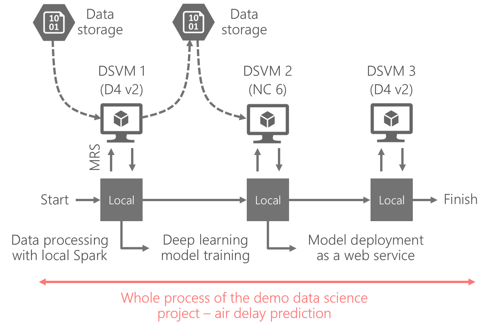

# Data Science Accelerator - *Operationalizing heterogeneous DSVM set for elastic data science on cloud.*

## Overview

This repo presents a example of operationalization on hetergeneous DSVM set for elastic data science on Azure cloud. 

The repository contains three parts

- **Data** Sample of air delay data is used. 
- **Code** An R markdown where step-by-step guide-line is provided as tutorial. Code scripts that will be executed remotely on DSVMs are placed under the sub-directories. 
- **Docs** Blog and presentation decks about this work will be added soon. 

## Business domain

The accelerator presents a walk-through on how to operationalize an end-to-end predictive analysis on air delay data with a heterogeneous set of Azure DSVMs. Modelling and feature engineering for this part are merely for illustration purpose, meaning that there is no fine-tune performed to achieve an optimal performance. 

## Data science problem

The problem is to predict air delay given features such as *day of month*, *day of week*, *origin of flight*, etc.

## Data understanding

The data set used in this accelerator is a sub set (10%) of the well-known air delay data set. The original data set can be obtained [here](https://packages.revolutionanalytics.com/datasets/).

## Modeling

For illustration purpose, a deep learning neural network is trained with and without GPU acceleration, *merely to compare the difference in training time*. While the focus is not primarily on model performance, readers can easily fine tune parameters or adjust network topology on their own. 

## Solution architecture

The overall architecture of the accelerator is depicted as follows.
